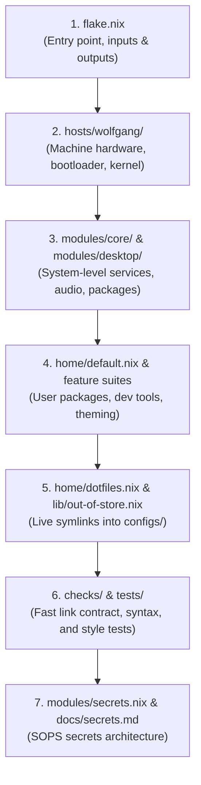
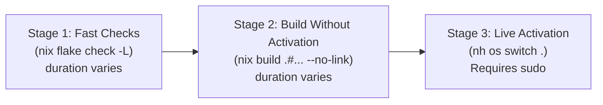

# Wolfgang's NixOS & Home Manager Dotfiles

A modular, reproducible NixOS configuration for `wolfgang`, managed as a unified Nix Flake. It runs the [niri](https://github.com/YaLTeR/niri) scrollable-tiling Wayland compositor with [Noctalia](https://github.com/noctalia-dev/noctalia) shell and greeter, paired with an **out-of-store symlink pattern** for instant live editing of application configurations.

> [!NOTE]
> **Who this guide is for**: Anyone with basic Nix knowledge looking to understand how this configuration works or how to build their own modular NixOS + Home Manager setup.

---

## 1. The Stack

| Component | Choice | Configuration Location |
| :--- | :--- | :--- |
| **Operating System** | [NixOS Unstable](https://nixos.org/) (`linuxPackages_latest`) | [hosts/wolfgang/default.nix](hosts/wolfgang/default.nix), [modules/core/](modules/core/) |
| **Compositor** | [niri](https://github.com/YaLTeR/niri) (scrollable-tiling Wayland) | [configs/niri/config.kdl](configs/niri/config.kdl) (live link) |
| **Desktop Shell** | [Noctalia](https://github.com/noctalia-dev/noctalia) + [Noctalia Greeter](https://github.com/noctalia-dev/noctalia-greeter) | [modules/desktop/default.nix](modules/desktop/default.nix) |
| **Terminal** | [Ghostty](https://ghostty.org/) | [configs/ghostty/config](configs/ghostty/config) (live link) |
| **Shell** | [Fish](https://fishshell.com/) + [Starship](https://starship.rs/) + [Atuin](https://atuin.sh/) | [configs/fish/](configs/fish/), [configs/starship.toml](configs/starship.toml) (live links) |
| **Editor** | [Neovim](https://neovim.io/) (via `neovim-nightly-overlay`) | [configs/nvim/](configs/nvim/) (live link) |
| **File Manager** | [Yazi](https://github.com/sxyazi/yazi) | [home/yazi.nix](home/yazi.nix) (reads [configs/yazi/](configs/yazi/)) |
| **System Runner** | [nh](https://github.com/viperML/nh) + [Home Manager](https://github.com/nix-community/home-manager) | [modules/core/programs.nix](modules/core/programs.nix), [home/default.nix](home/default.nix) |
| **Secrets Engine** | [sops-nix](https://github.com/Mic92/sops-nix) (integration only) | [modules/secrets.nix](modules/secrets.nix), [docs/secrets.md](docs/secrets.md) |

---

## 2. Beginner Reading Path

If you are exploring this codebase to learn how to structure a NixOS flake, follow this linear reading roadmap:



1. **[flake.nix](flake.nix)**: Start here. Observe how external flake inputs are declared, pinned, and passed down to NixOS and Home Manager via `specialArgs` and `extraSpecialArgs`.
2. **[hosts/wolfgang/default.nix](hosts/wolfgang/default.nix)**: The physical host definition. See how hardware configuration, bootloader (`systemd-boot`), kernel modules, networking, and `system.stateVersion` are declared for this specific machine.
3. **[modules/core/](modules/core/) & [modules/desktop/](modules/desktop/)**: System-level concerns. Notice how [modules/core/default.nix](modules/core/default.nix) bundles focused files ([nix.nix](modules/core/nix.nix), [packages.nix](modules/core/packages.nix), [programs.nix](modules/core/programs.nix), [services.nix](modules/core/services.nix), [audio.nix](modules/core/audio.nix), [locale.nix](modules/core/locale.nix), [accounts.nix](modules/core/accounts.nix)), while [modules/desktop/default.nix](modules/desktop/default.nix) configures Niri and Noctalia.
4. **[home/default.nix](home/default.nix)**: Home Manager user configuration. See how user packages are organized into focused modules: [development.nix](home/development.nix) (editors, compilers, LSPs), [tools.nix](home/tools.nix) (CLI inspection and utilities), [applications.nix](home/applications.nix) (GUI apps, Flatpaks), and [appearance.nix](home/appearance.nix) (GTK themes and fonts).
5. **[home/dotfiles.nix](home/dotfiles.nix)** and **[lib/out-of-store.nix](lib/out-of-store.nix)**: The live-link manifest. Learn how dotfiles inside [configs/](configs/) are symlinked directly to `~/.config/` without writing them to the immutable Nix store.
6. **[checks/default.nix](checks/default.nix)** and **[tests/](tests/)**: Automated verification suite. See how `nix flake check -L` enforces link integrity ([link_contract.py](tests/link_contract.py)), configuration syntax ([config_syntax.py](tests/config_syntax.py)), cache policy, and Nix code style.
7. **[modules/secrets.nix](modules/secrets.nix)** and **[docs/secrets.md](docs/secrets.md)**: Encrypted secrets management architecture. Understand why plaintext secrets must never be placed in `/nix/store` and how `sops-nix` handles deferred enrollment.

---

## 3. Architecture & Module Traceability

Every `.nix` file in this repository has an explicit owner and a clear position in the import tree:

```
flake.nix (outputs)
├── nixosConfigurations.wolfgang
│   ├── hosts/wolfgang/default.nix
│   │   ├── hosts/wolfgang/hardware-configuration.nix
│   │   ├── modules/core/default.nix
│   │   │   ├── modules/core/nix.nix
│   │   │   ├── modules/core/packages.nix
│   │   │   ├── modules/core/programs.nix
│   │   │   ├── modules/core/locale.nix
│   │   │   ├── modules/core/audio.nix
│   │   │   ├── modules/core/services.nix
│   │   │   └── modules/core/accounts.nix
│   │   └── modules/desktop/default.nix
│   ├── modules/secrets.nix
│   └── home-manager.nixosModules.home-manager
│       └── users.giovanni = import ./home (home/default.nix)
│           ├── inputs.nix-flatpak.homeManagerModules.nix-flatpak
│           ├── home/dotfiles.nix (imports lib/out-of-store.nix)
│           ├── home/shell.nix
│           ├── home/yazi.nix
│           ├── home/appearance.nix
│           ├── home/stats.nix
│           ├── home/anki.nix
│           ├── home/development.nix
│           ├── home/tools.nix
│           └── home/applications.nix
├── homeConfigurations.giovanni (read-only query target; shares system pkgs)
└── checks.x86_64-linux (checks/default.nix -> tests/)
```

### Module Traceability Matrix

| File / Component | Imported By | Privileges / Scope | Deployed Target | Activation / Reload |
| :--- | :--- | :--- | :--- | :--- |
| [hosts/wolfgang/default.nix](hosts/wolfgang/default.nix) | [flake.nix](flake.nix) | System (`root`) | `/nix/store`, `/etc` | `nh os switch .` (requires sudo) |
| [modules/core/](modules/core/) | [hosts/wolfgang/default.nix](hosts/wolfgang/default.nix) | System (`root`) | `/nix/store`, `/etc` | `nh os switch .` (requires sudo) |
| [modules/desktop/](modules/desktop/) | [hosts/wolfgang/default.nix](hosts/wolfgang/default.nix) | System (`root`) | `/nix/store`, `/etc` | `nh os switch .` (requires sudo) |
| [modules/secrets.nix](modules/secrets.nix) | [flake.nix](flake.nix) | System (`root`) | `/run/secrets/` | `nh os switch .` (requires sudo) |
| [home/default.nix](home/default.nix) | [flake.nix](flake.nix) (via Home Manager) | User (`giovanni`) | `/etc/profiles/per-user` | `nh os switch .` (switched together) |
| [home/dotfiles.nix](home/dotfiles.nix) | [home/default.nix](home/default.nix) | User (`giovanni`) | `~/.config/`, `~/` | Instant symlink to [configs/](configs/) |
| [configs/](configs/) (Live files) | Symlinked by [home/dotfiles.nix](home/dotfiles.nix) | User (`giovanni`) | Target apps | **Instant edit** (app reload / new shell) |

---

## 4. The Three Configuration Layers (Mental Model)

One of the biggest hurdles when starting with Nix on a workstation is understanding where different configurations live and how they get applied. This repository separates configuration into three distinct layers:

### Layer 1: NixOS System Configuration
- **What it controls**: The Linux kernel, hardware drivers, disks/filesystems, bootloader, system-wide background daemons (e.g. `upower`, `tailscale`, `syncthing`, `keyd`), user account privileges (`wheel`, `networkmanager`), and system environment.
- **Where it lives**: [hosts/wolfgang/](hosts/wolfgang/), [modules/core/](modules/core/), [modules/desktop/](modules/desktop/), [modules/secrets.nix](modules/secrets.nix).
- **How it builds**: Evaluated as a single immutable system closure in `/nix/store/<hash>-nixos-system-wolfgang-...`.
- **How it applies**: Activated via `nh os switch .` (which calls `nixos-rebuild switch` with `sudo`).

### Layer 2: Home Manager User Configuration
- **What it controls**: User-installed command-line utilities and graphical apps, user shell environment variables (`sessionPath`), GTK/desktop theming, Flatpak package lists, and user systemd services.
- **Where it lives**: [home/](home/).
- **How it integrates**: It is embedded directly as a NixOS module inside [flake.nix](flake.nix) (`home-manager.nixosModules.home-manager`). We configure `useGlobalPkgs = true` so Home Manager shares the exact same package evaluation as the system, and `useUserPackages = true` so user packages are installed to `/etc/profiles/per-user/giovanni`.
- **How it applies**: Because it is embedded in the NixOS configuration, running `nh os switch .` switches **both** through one system rebuild. This is not an all-or-nothing transaction: activation can fail partway, and service status still needs checking.
- **Read-only query target**: [flake.nix](flake.nix) also exports `homeConfigurations.giovanni`. This exists strictly for read-only inspection commands like `home-manager news --flake .`. **Never run `nh home switch` or activate this output independently.**

### Layer 3: Live Application Configs (Out-of-Store Symlinks)
- **What it controls**: Fast-iterating application configurations (e.g., Neovim Lua plugins, Niri keybindings, Fish functions and abbreviations, Ghostty terminal settings, Starship prompt).
- **How it works**: Defined in [home/dotfiles.nix](home/dotfiles.nix) using `lib.file.mkOutOfStoreSymlink` (via [lib/out-of-store.nix](lib/out-of-store.nix)). Instead of copying dotfiles into read-only `/nix/store` derivations, Home Manager creates symlinks pointing directly into `/home/giovanni/dotfiles/configs/...`.
- **Why this matters**:
  - Editing `configs/niri/config.kdl` takes effect the moment you save (Niri hot-reloads).
  - Editing `configs/fish/functions/` is active in any new shell tab immediately.
  - No need to run `nh os switch` or wait for a Nix build just to tweak an editor shortcut!

### Layer 3b: The Store-Built Hybrid Exceptions
Two applications in [home/](home/) read source files from [configs/](configs/) into the Nix store at build time:
1. **[home/yazi.nix](home/yazi.nix)**: Reads `configs/yazi/*.toml` via `builtins.readFile`, converts them to Nix attrsets with `builtins.fromTOML`, and configures the `programs.yazi` module. This allows Home Manager to hermetically package Yazi plugins and Catppuccin flavors into store paths.
2. **[home/anki.nix](home/anki.nix)**: Reads `configs/anki/catppuccin_mocha.css` via `builtins.readFile`, wraps it into a store path using `pkgs.writeText`, and injects it into a custom `synapsePro` Anki addon derivation.

> [!WARNING]
> Because Yazi and Anki are store-built from config sources, edits in `configs/yazi/` or `configs/anki/` do **not** take effect immediately. They require running `nh os switch .`.

---

## 5. The Link Contract & Ownership Boundaries

When combining live out-of-store symlinks with Home Manager, you must respect the **Ownership Boundary**:

> **The Golden Rule**: Never let a live out-of-store symlink point to a directory where Home Manager also generates individual managed files.

### Why this rule exists (The Activation Overwrite Bug)
If you symlink an entire directory (e.g. `~/.config/yazi` -> `~/dotfiles/configs/yazi`), and a Home Manager module simultaneously tries to generate a file inside that directory (e.g. `programs.yazi` writing `~/.config/yazi/yazi.toml`), Home Manager's activation script will follow the symlink and write its `/nix/store/...` symlink **directly into your Git checkout**. This replaces your real configuration files with read-only store symlinks and corrupts pure Nix flake evaluation!

### How this repository enforces the contract
The test suite in [tests/link_contract.py](tests/link_contract.py) automatically runs during `nix flake check -L`. It verifies that:
1. Every source file referenced in [home/dotfiles.nix](home/dotfiles.nix) exists inside `configs/`.
2. No live-linked target overlaps a generated target or another live link. Distinct sibling paths are allowed.

---

## 6. Key Nix & Flake Concepts Explained

### 1. Inputs, Locks, and Follows
In [flake.nix](flake.nix):
- **`inputs`**: Declarations of external dependencies (e.g., `nixpkgs`, `home-manager`, `sops-nix`).
- **`flake.lock`**: An autogenerated JSON file that pins the exact Git commit SHA and cryptographic hash (`narHash`) for every input. This pins dependency sources. It does not guarantee that every upstream build is deterministic or snapshot the external contents of live-linked files.
- **`inputs.<name>.inputs.nixpkgs.follows = "nixpkgs"`**: By default, each flake input brings its own pinned version of `nixpkgs`. If `home-manager` and `sops-nix` use their own nixpkgs versions, Nix will download and evaluate three separate, massive package repositories. The `follows` directive instructs dependencies to reuse the top-level `nixpkgs` input, reducing duplicate inputs. Compatibility still needs evaluation and testing.

### 2. The Module System: Arguments and Imports
Modules can be plain attribute sets or functions receiving module arguments. A function-form module looks like:
```nix
{ config, pkgs, lib, inputs, ... }:
```
- **`config`**: The fully resolved, merged system or user configuration.
- **`pkgs`**: The package set instantiated for the host platform (`x86_64-linux`), with system overlays applied.
- **`lib`**: The Nix library functions (`lib.mkDefault`, `lib.mkForce`, `lib.mkBefore`, etc.).
- **`inputs`**: Injected via `specialArgs = { inherit inputs; };` in NixOS and `extraSpecialArgs = { inherit inputs; };` in Home Manager.
- **`...`**: The ellipsis allows the function to accept additional module arguments without throwing an error.
- **`imports = [ ... ];`**: Includes other module files. Nix evaluates all imported files and merges their declarations into a single configuration tree.

### 3. Option Merging and Priorities
Nix options are merged deterministically:
- **Attribute sets** merge recursively.
- **Lists** (such as package lists) concatenate according to module definition ordering; use explicit ordering helpers when order matters.
- **Merging depends on the option type.** Strings and integers commonly require equal values at the same priority; some types have special merge behavior (for example, boolean options can merge with logical OR).

To resolve conflicting scalar values or control list placement, use priority helpers from `lib`:
- `lib.mkDefault <value>`: Priority 1000. Used for baseline defaults that can be easily overridden elsewhere.
- Normal assignment: Priority 100. Standard configuration assignment.
- `lib.mkForce <value>`: Priority 50. Forces an option over any standard assignment.
- `lib.mkBefore [ ... ]`: Forces items in a list to appear **at the beginning** of the merged list (used in [modules/core/accounts.nix](modules/core/accounts.nix) to preserve the pre-refactor user-package ordering).
- `lib.mkAfter [ ... ]`: Appends items to the end of a merged list.

### 4. `stateVersion` Demystified
In [hosts/wolfgang/default.nix](hosts/wolfgang/default.nix) (`system.stateVersion = "26.05";`) and [home/default.nix](home/default.nix) (`home.stateVersion = "26.05";`):

> [!CAUTION]
> **Do NOT bump `stateVersion` when updating NixOS!** `stateVersion` is not the version of NixOS or packages currently running. Package versions come from the pinned inputs and your package selections, overrides, and local derivations—not `stateVersion`.

`stateVersion` records the release version that was active when the system was originally installed. When upstream NixOS or Home Manager introduces a breaking migration for stateful storage (e.g., changing the default directory format of a database or user service), it checks `stateVersion` to maintain backwards compatibility and prevent data loss. Bumping `stateVersion` without manually executing upstream migration scripts can break your installed applications.

### 5. Secrets Management Architecture
- Normal Nix configurations are compiled into the world-readable `/nix/store` (`0755` directory permissions). Plaintext secrets (passwords, tokens, SSH private keys) must **never** be placed in `/nix/store` or committed to Git.
- [sops-nix](https://github.com/Mic92/sops-nix) encrypts secrets with `age` public keys. Encrypted ciphertext files (`secrets/wolfgang.yaml`) are safely committed to Git.
- At system boot or switch, `sops-nix` runs an activation script as `root` to decrypt the secrets into a RAM-backed filesystem at `/run/secrets/`, with custom ownership and strict permissions (`0400`).
- Consuming services reference the secret via `config.sops.secrets.<name>.path`.
- **Status in this repo**: Tooling and module wiring are established in [modules/secrets.nix](modules/secrets.nix). Key generation and secret enrollment are deferred. See [docs/secrets.md](docs/secrets.md) for the operational runbook.

---

## 7. Worked Examples

Here are four accurate, concrete workflows for common tasks on this repository.

### Example 1: Adding a Package

#### Case A: Adding a user CLI tool or utility
1. Open [home/tools.nix](home/tools.nix) (or [home/development.nix](home/development.nix) if it is a compiler, LSP, or dev tool).
2. Add the package attribute name from Nixpkgs (e.g. `htop`):
   ```nix
   # home/tools.nix
   home.packages = with pkgs; [
     htop
     bat
     ripgrep
     # ...
   ];
   ```
3. Verify the change without activation:
   ```bash
   nix flake check -L
   ```
4. Build the system closure to ensure no package collisions:
   ```bash
   nix build .#nixosConfigurations.wolfgang.config.system.build.toplevel --no-link
   ```
5. Activate the change:
   ```bash
   nh os switch .
   ```

#### Case B: Adding a low-level system or hardware diagnostic package
1. Open [modules/core/programs.nix](modules/core/programs.nix).
2. Add the package to `environment.systemPackages`:
   ```nix
   environment.systemPackages = with pkgs; [
     usbutils
     pciutils
     my-system-tool
   ];
   ```
3. Follow the same verify-build-switch cycle as above.

---

### Example 2: Linking an Application Config (Live Out-of-Store)

For a hypothetical app `mytool`, the following demonstrates link mechanics. Its sample TOML is illustrative, not a real app schema. Lazygit already has a link here—do not add a second owner.

1. **Create the configuration file** inside `configs/`:
   ```bash
   mkdir -p configs/mytool
   cat << 'EOF' > configs/mytool/config.toml
   [general]
   theme = "dark"
   EOF
   ```
2. **Track the new file in Git** (mandatory for Nix flakes to see files):
   ```bash
   git add -N configs/mytool/config.toml
   ```
3. **Declare the live link** in [home/dotfiles.nix](home/dotfiles.nix):
   ```nix
   xdg.configFile = links {
     # ... existing links ...
     "mytool/config.toml" = "mytool/config.toml";
   };
   ```
4. **Run the fast validation checks**:
   ```bash
   nix flake check -L
   ```
   This executes [tests/link_contract.py](tests/link_contract.py) to ensure the source file exists and does not conflict with generated store files, and [tests/config_syntax.py](tests/config_syntax.py) to validate TOML syntax.
5. **Activate the link once**:
   ```bash
   nh os switch .
   ```
   Home Manager creates a symlink: `~/.config/mytool/config.toml -> /home/giovanni/dotfiles/configs/mytool/config.toml`.
6. **Iterate live**: Now edit `configs/mytool/config.toml`. Your changes take effect immediately when `mytool` runs, with no further Nix rebuilds needed!

---

### Example 3: Enabling a System Service

Suppose you want to enable periodic SSD TRIM on the host:

1. Open [modules/core/services.nix](modules/core/services.nix).
2. Add the service option under `services`:
   ```nix
   services = {
     fstrim.enable = true;
     printing.enable = true;
     upower.enable = true;
     # ...
   };
   ```
3. **Verify formatting and syntax**:
   ```bash
   nix flake check -L
   ```
4. **Verify evaluation and systemd unit generation without activating**:
   ```bash
   nix build .#nixosConfigurations.wolfgang.config.system.build.toplevel --no-link
   ```
5. **Activate the system service**:
   ```bash
   nh os switch .
   ```
6. **Verify the active systemd service/timer**:
   ```bash
   systemctl status fstrim.timer
   ```

---

### Example 4: Verifying Changes Without Activation

Before applying changes to your live system, always follow the progressive 3-stage validation pipeline:



#### Stage 1: Source and Evaluation Checks
```bash
nix flake check -L
```
Runs without root privileges. Checks:
- Nix formatting (`nixfmt --check`)
- Unused variables and dead code (`deadnix --fail`)
- Nix style anti-patterns (`statix check`)
- Out-of-store link contract boundaries ([tests/link_contract.py](tests/link_contract.py))
- Application syntax parsing for TOML, JSON, Fish, and Lua ([tests/config_syntax.py](tests/config_syntax.py))
- Niri compositor configuration validation (`niri validate -c ...`)
- Binary cache and substitution policy consistency ([lib/caches.nix](lib/caches.nix))

#### Stage 2: Full Build Without Activation
```bash
nix build .#nixosConfigurations.wolfgang.config.system.build.toplevel --no-link
```
*(Or alternatively: `nixos-rebuild build --flake .#wolfgang`)*
- Fully evaluates the entire NixOS and Home Manager configuration graph.
- Derives all packages, wrapper scripts, and systemd units into `/nix/store`.
- Catches assertion errors, option type mismatches, and package name collisions.
- **Leaves your running system, `/etc`, and user home directory completely untouched.**

> [!WARNING]
> `nh os test` is **not** a dry run! It switches the running system's generation temporarily until the next reboot. Always use `nix build ... --no-link` to test evaluation safely without activation.

#### Stage 3: Live Activation
Once stages 1 and 2 pass cleanly, activate your changes:
```bash
nh os switch .
```

---

## 8. Workflow & Commands Cheat Sheet

### Common Operations

| Goal | Command | Scope |
| :--- | :--- | :--- |
| **Run Fast Checks** | `nix flake check -L` | Syntax, link contracts, style |
| **Build Without Activation** | `nix build .#nixosConfigurations.wolfgang.config.system.build.toplevel --no-link` | Full system compilation (no switch) |
| **Switch System** | `nh os switch .` | Switches NixOS + Home Manager |
| **Switch on Next Boot** | `nh os boot .` | Builds system, sets default boot generation |
| **Update Flake Inputs** | `nix flake update --flake ~/dotfiles` | Updates `flake.lock` |
| **Garbage Collect** | `nh clean all` | Removes old generations & optimizes store |
| **Spawn Temp Package** | `nix-shell -p <pkg>` | Temporary interactive shell |
| **Dev Shell** | `nix develop` | Enters dev environment with SOPS, age, nixfmt |

### Useful Fish Abbreviations

| Abbr | Command | Purpose |
| :--- | :--- | :--- |
| `nsw` | `nh os switch` | Rebuild and activate current configuration |
| `nrb` | `nh os boot` | Configure next boot generation |
| `ncu` | `nix flake update --flake ~/dotfiles` | Update all flake inputs |
| `ncl` | `nh clean all` | Garbage collect old system generations |
| `nq` | `nix-shell -p` | Quick ad-hoc tool testing |
| `v` | `nvim` | Open Neovim |
| `gd` | `git diff` | Inspect unstaged Git changes |
| `cnavi` | `navi --cheatsh` | Search cheatsheets |
| `fnav` | `fnav` | Fuzzy directory navigation (fzf + zoxide + eza) |
| `ndiff` | `ndiff` | Diff system packages between generations (`nvd diff`) |

### Key Modifier Segregation

Keybindings are segregated across layers to eliminate shortcut collisions:
- **`Super` (`Mod`)**: Window manager & compositor ([configs/niri/config.kdl](configs/niri/config.kdl))
- **`Ctrl + Alt`**: Terminal emulator window actions ([configs/ghostty/config](configs/ghostty/config))
- **`Space` (`<leader>`)**: Editor operations ([configs/nvim/plugin/03-keymaps.lua](configs/nvim/plugin/03-keymaps.lua))

---

## 9. Adapting This Repository to Another Machine

Use this repository as a reading example, not an installation script. Do not switch
another machine directly to Wolfgang's hardware configuration.

- Generate hardware configuration for your own machine; review disks, mounts and bootloader settings.
- Change the host output, account name, home directory, checkout path and host-specific services together.
- Review the campus-network dispatcher and remove it if it does not apply to you.
- Preserve state versions for an existing installation; choose appropriate initial versions for a new one.
- The checks and live-link helper assume this checkout layout. Update their paths when adapting it.
- Read [the secrets runbook](docs/secrets.md) before enrolling keys; encrypted files without recoverable keys are not a backup.
